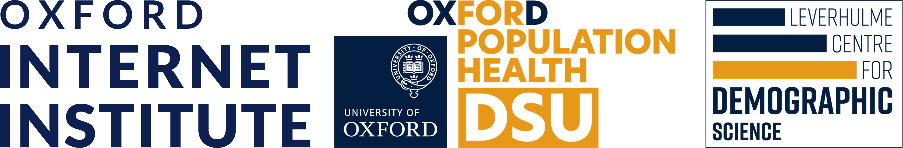

### Welcome to the **Metrics and Models** homepage!

Hi! We are a group of health and social data scientists located at the University of Oxford. This is a website dedicated to a new online, open seminar series which we're launching.

**Note**: This seminar series is now *live*! We are also now on [Oxford Talks](https://talks.ox.ac.uk/talks/series/id/d8857aca-129d-4d6d-acbc-d410d6e115bd)!

**Frequency**: Every other Wednesday, starting July 2nd, 2025.

**Open to Everyone!** Importantly, this seminar series is open to *everyone*. We've tried to schedule it at a time of day that's hopefully roughly equitable to people in the Americas and Asia all the same. It is not just limited to academics: attendees are welcome from all (e.g., private, public, third) sectors!

**Focus**: We have a focus on the metrics and models used across health and social data science. We're specifically interested -- but not exclusively -- in predictive methods (i.e., machine/deep learning, LLMs), because this is where most of the organiser's shared interests overlap. However, we are broadly interested in all computational tools and techniques, including but not limited to the mathematical philosophy underpinning prediction, and efforts to make research more reproducible in general.

**Time and Place**: The seminar series will be held online for now at 2pm UK time (GMT and BST). In the future, we are hoping to host the talks in a hybrid fashion, where\when we are able to invite speakers to talk in person.

**Registration**: To register, send a blank email or otherwise to [metrics_and_models-subscribe [at] maillist.ox.ac.uk](mailto:sympa@maillist.ox.ac.uk?subject=subscribe%20metrics_and_models) (replace the ' [at] ' with '@'); this is preferred, as you'll automatically get added to all forthcoming talks upon reply. See our maillist page [here](https://web.maillist.ox.ac.uk/ox/info/metrics_and_models) to subscribe to the list directly if you have an Oxford SSO. Alternatively, click [here](https://forms.office.com/e/M3j2M2hBFt) to access a form to register, and we will (~weekly) add new registrants from that onto the maillist.

**Interested in Presenting?**: If you're interested in presenting something to this seminar series, we have a form [here](https://forms.office.com/e/KsFZYcMz5C)!

**Off-weeks**: We'll be meeting as a local 'lab' in the off-weeks. Details are <a href="/details/internal_lab_sessions.html">here</a>. These will feature informal presentations for feedback, general updates, and discussions re: potential collaboration/opportunities. If you're interested in coming along to these offline meetings (or just want to chat), please get in touch with us at metrics_and_models_mgmt [at] maillist.ox.ac.uk.

**Who**: In alphabetical order, we are [Charlie](http://crahal.com/), [Claire](https://duiyidai.github.io/), [Daniel](https://github.com/dhvalden), [Jiani](http://vallerrr.github.io/), [Luc](https://rocher.lc/), [Mark](https://markverhagen.me/), [Ridhi](https://www.sociology.ox.ac.uk/people/ridhi-kashyap), and [Xiaowen](https://web.media.mit.edu/~xdong). Our organisational team are part of the [Demographic Science Unit](https://www.demography.ox.ac.uk/), [Engineering Science](https://eng.ox.ac.uk/), the [Oxford Internet Institute](https://www.oii.ox.ac.uk/), and [Sociology](https://www.sociology.ox.ac.uk/).

**Previous Talks**: Details on previous talks can be found <a href="/details/previous_talks.html">here</a>.

**Forthcoming Talks**: Please find below the details of some forthcoming talks held as part of the Metrics and Models seminar series:

<table style="margin-left: auto; margin-right: auto;">
  <thead>
    <tr>
      <th>Speaker</th>
      <th>Date</th>
      <th>Title</th>
      <th>More Details</th>
    </tr>
  </thead>
  <tbody>
    <tr>
      <td><a href="https://fbarez.github.io/" target="_blank" rel="noopener noreferrer">Fazl Barez</a></td>
      <td>14:00 GMT, 5th February, 2026</td>
      <td>How can we automate Interpretability to help people make better and faster decisions?</td>
      <td><a href="/details/fazlbarez.html">More details</a></td>
    </tr>
    <tr>
      <td><a href="https://munibmesinovic.com/" target="_blank" rel="noopener noreferrer">Munib Mesinovic</a></td>
      <td>14:00 GMT, 19th February, 2026</td>
      <td>TBC</td>
      <td><a href="/details/munibmesinovic.html">TBC</a></td>
    </tr>
    <tr>
    <td><a href="https://www.cjbarrie.com/" target="_blank" rel="noopener noreferrer">Chris Barrie</a></td>
      <td>14:00 GMT, 5th March, 2026</td>
      <td>Synthetic personas distort the structure of human belief systems</td>
      <td><a href="/details/chrisbarrie.html">More details</a></td>
    </tr>
    <tr>
    <td><a href="https://jundewu.com/" target="_blank" rel="noopener noreferrer">Junde Wu</a></td>
      <td>14:00 GMT, **18th March**, 2026</td>
      <td>TBC</td>
      <td><a href="/details/jundewu.html">TBC</a></td>
    </tr>
    <tr>
    <td><a href="https://sites.google.com/view/laiweisoc" target="_blank" rel="noopener noreferrer">Confirmation in Progress!</a></td>
      <td>14:00 GMT, *28th May*, 2026</td>
      <td>TBC</td>
      <td><a href="/details/laiwei.html">TBC</a></td>
    </tr>
  </tbody>
</table>

 
 

    

